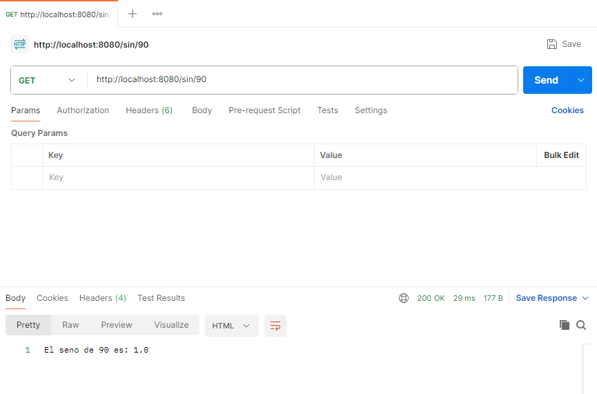
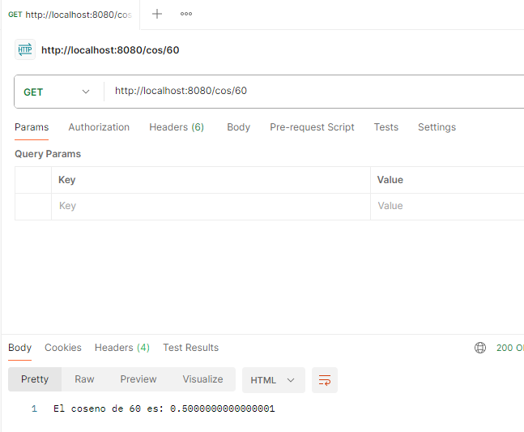
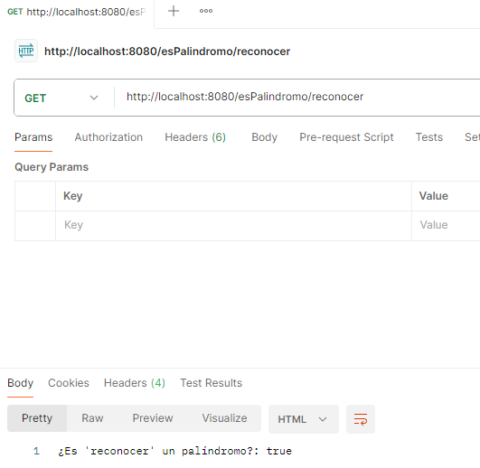
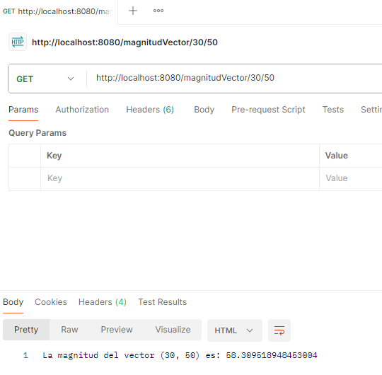

# TALLER DE DE MODULARIZACIÓN CON VIRTUALIZACIÓN E INTRODUCCIÓN A DOCKER
El proyecto SparkDockerDemoLive es una aplicación Java que implementa un servidor web utilizando Spark, un framework web ligero para Java. El objetivo principal de esta aplicación es demostrar cómo implementar un servidor web que realiza operaciones matemáticas simples y verifica si una cadena es un palíndromo.

Aquí hay una descripción general de las características y componentes principales del proyecto:

1. SparkWebServer: Esta clase es la entrada principal del programa. Configura el servidor Spark para escuchar en un puerto específico y define las rutas para manejar diferentes solicitudes HTTP.

2. Operaciones: Esta clase contiene métodos estáticos para realizar diferentes operaciones matemáticas, como calcular el seno y coseno de un ángulo, determinar si una cadena es un palíndromo y calcular la magnitud de un vector.

3. Interfaz HTML/CSS/JavaScript: El proyecto incluye una interfaz web simple que permite al usuario realizar las operaciones matemáticas mencionadas anteriormente. La interfaz está compuesta por formularios HTML para ingresar los datos necesarios y utiliza JavaScript para realizar solicitudes HTTP asíncronas al servidor Spark y mostrar los resultados en la página web sin necesidad de recargarla.

## Empezando...

Estas instrucciones te ayudarán a obtener una copia del proyecto y ponerlo en funcionamiento en tu máquina local con fines de desarrollo y pruebas.

### Requisitos previos

1. Java Development Kit (JDK) 17: La configuración del compilador Java (maven.compiler.source y maven.compiler.target) especifica que el código fuente y el destino deben ser compatibles con JDK 17.

2. Maven: Se requiere Maven para compilar y administrar las dependencias del proyecto. Maven se encarga de descargar las dependencias declaradas en el archivo POM y construir el proyecto.

3. Dependencias del proyecto:

    * **JUnit 3.8.1:** Utilizado para realizar pruebas unitarias (este es un requisito de prueba).
    * **Spark Core 2.9.4:** Framework web utilizado en el proyecto para construir aplicaciones web.
    * **SLF4J API 2.0.12:** API para registrar mensajes de registro (Logging).
    * **SLF4J Simple 2.0.12:** Implementación simple de SLF4J API para la salida de registros.
### Instalación

Sigue estos pasos para configurar el entorno de desarrollo:

1. Clona el repositorio en tu máquina virtual (opcional).

    ```
    git clone https://github.com/JaiderArleyGonzalez/TALLER-DE-DE-MODULARIZACION-CON-VIRTUALIZACION-E-INTRODUCCION-A-DOCKER.git
    ```
2. Abre Docker.

3. Ingresa el siguiente comando en tu consola

    ```
    docker run -p 8080:46000 -d --name TallerDocker jaidergonzalez/firstsprkwebapprepo
    ```
   Deberías poder visualizar lo siguiente en el Docker Desktop

   
### Corriendo la aplicación
Puedes ingresar a la aplicación por medio de la dirección:

* http://localhost:8080/

Allí podrás visualizar lo siguiente:


### Evidencia del funcionamiento

Pruebas de ejecución:


Pruebas de get en PostMan
* sin:

   

* cos:

   

* Palíndromo:

   

* Magnitud del vector:

   

### Pruebas unitarias

Ejecuta el siguiente comando para los test:

```
    mvn test
```

allí obtendrás lo siguiente:


Las pruebas pasan correctamente:


### Diseño
El proyecto SparkDockerDemoLive es una aplicación web que proporciona operaciones matemáticas básicas a través de un servidor Spark. El diseño del proyecto se centra en la simplicidad y la eficiencia para proporcionar funcionalidades matemáticas esenciales a través de una interfaz web amigable.

* Interfaz de Usuario Simple y Funcional: La interfaz de usuario se presenta en forma de formularios HTML donde los usuarios pueden ingresar datos y realizar cálculos de manera intuitiva. Cada formulario está asociado con un botón de "Calcular" que envía una solicitud al servidor para procesar la operación correspondiente.

* Funcionalidades Claras y Directas: Las operaciones disponibles incluyen el cálculo del seno, coseno, verificación de palíndromos y magnitud de vectores. Estas operaciones cubren un conjunto básico pero esencial de funciones matemáticas.
### Arquitecura
La arquitectura del proyecto sigue un enfoque sencillo pero efectivo, basado en un patrón de diseño de servidor web clásico.

* Servidor Spark: La clase SparkWebServer actúa como el controlador principal del servidor web. Utiliza Spark para configurar las rutas de acceso y definir cómo responder a las solicitudes HTTP entrantes. Las rutas están asociadas con métodos que realizan las operaciones matemáticas utilizando la clase Operaciones.

* Lógica de Operaciones: La clase Operaciones contiene métodos estáticos para calcular el seno, coseno, verificar palíndromos y calcular la magnitud del vector. Estos métodos son invocados por el servidor Spark cuando se accede a las rutas correspondientes.

* Interfaz de Usuario Web: La interfaz de usuario está escrita en HTML y CSS, y utiliza JavaScript para interactuar con el servidor. Cada operación matemática tiene su propio formulario HTML que recopila datos del usuario y los envía al servidor para su procesamiento.

### Cómo generar imágenes en Docker:

Debe contar con los siguientes archivos en el directorio raíz:

- Dockerfile

    

- docker-compose.yml

    

Usando la herramienta de línea de comandos de Docker construya la imagen:
```
    docker build --tag dockersparkprimer .
```
A partir de la imagen creada cree tres instancias de un contenedor docker independiente de la consola (opción “-d”) y con el puerto 46000 enlazado a un puerto físico de su máquina (opción -p):
```
    docker run -d -p 34000:46000 --name firstdockercontainer dockersparkprimer
    docker run -d -p 34001:46000 --name firstdockercontainer2 dockersparkprimer
    docker run -d -p 34002:46000 --name firstdockercontainer3 dockersparkprimer
```
Ejecute el docker compose:
```
    docker-compose up -d
```

Regístrate y crea un repositorio en DockerHub


En su motor de docker local cree una referencia a su imagen con el nombre del repositorio a donde desea subirla

```
    docker tag dockersparkprimer jaidergonzalez/firstsprkwebapprepo
```
Autentíquese en su cuenta de dockerhub (ingrese su usuario y clave si es requerida):
```
    docker login
```

Empuje la imagen al repositorio en DockerHub

```
docker push dnielben/firstsprkwebapprepo:latest
```
**Al final deberá obtener lo siguiente:**

*Contenedores en docker:*


*Imágenes en docker:*


*DockerHub*


### Construido con:
- Java - Programming language
- Maven - Dependency Management
### Autor
- Jaider Gonzalez


